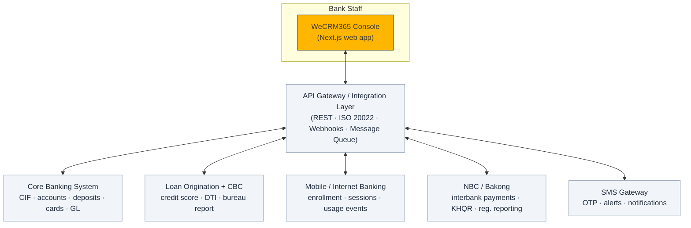
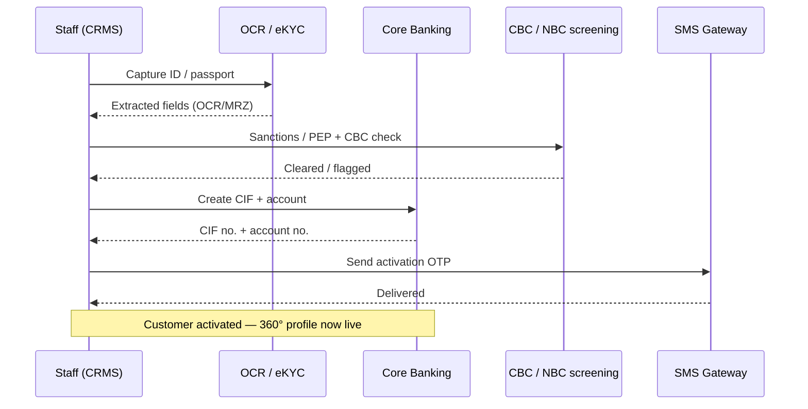

<!--
Slide-ready markdown for WeCRM365 (KB PRASAC Bank).
Render with Marp (VS Code "Marp for VS Code" extension → Export),
or paste into Gamma / Slidev / any Markdown slide tool.
Each `---` starts a new slide. Mermaid renders in Slidev/Marp-mermaid/GitHub.
-->

# WeCRM365

### Banking Customer Relationship Management System

**KB PRASAC Bank · Cambodia**
One staff console for every customer journey — onboarding, servicing, lending, payments, and compliance.

---

# 1 · What & Why a CRMS?

---

## What is WeCRM365?

A **staff-facing CRMS** — the single console bank employees use to know and serve every customer.

- **Customer 360°** — one screen unifies accounts, deposits, cards, loans, investments, insurance, digital channels, and every interaction.
- **Role-aware** — built for relationship officers, tellers, credit officers, and support agents.
- **End-to-end** — covers the journey from **onboarding (eKYC)** → **servicing** → **cross-sell** → **support** → **compliance**.
- **Localized for Cambodia** — Khmer / English / Korean UI, KHR ៛ & USD $, KHQR & Bakong payments.

> Not a core banking system — it is the **relationship & orchestration layer** that sits on top of the bank's systems.

---

## Why a CRMS? — The business drivers

| Driver | Without CRMS | With WeCRM365 |
|---|---|---|
| **Single source of truth** | Data siloed across core, mobile, loans | One 360° customer profile |
| **Faster service** | Staff jump between 5+ systems | Everything on one screen → lower handling time |
| **Grow revenue** | Missed cross-sell | Next-best-action & bancassurance prompts |
| **Compliance** | Manual KYC/CDD tracking | KYC/CDD, CBC, sanctions/PEP, audit trail built in |
| **Control & trust** | Ad-hoc approvals | Maker-checker, SLA tracking, device/security oversight |
| **Consistency** | Fragmented experience | Unified, branded, multilingual console |

---

## Why now — the Cambodia context

- **Digital-first banking** — Bakong, KHQR, mobile banking adoption is nationwide.
- **Regulatory expectation** — NBC oversight, CBC credit reporting, AML/KYC obligations.
- **Competition** — customers expect fast onboarding (eKYC) and personalized service.
- **Dual currency & bilingual** — operations must handle KHR/USD and Khmer/English natively.

**Outcome:** serve more customers, faster, with lower risk and higher wallet share.

---

# 2 · CRMS Functions

*Title + short description*

---

## Core customer functions

- **Customer 360° View** — Unified profile across all products, channels, and interactions on one screen.
- **Customer Onboarding (eKYC)** — Guided ID/passport capture with OCR/MRZ auto-fill, liveness, and sanctions/PEP screening → straight-through activation.
- **Customer Information & KYC/CDD** — Editable individual **and** corporate profiles, household/related parties, KYC/CDD status, consent, and a document vault.
- **Accounts & Deposits** — Current/savings accounts, savings goals, and fixed-deposit holdings with rates and maturities.

---

## Product & transaction functions

- **Cards Management** — Issued cards with limits, statuses, and controls (online / contactless / international toggles).
- **Lending & Loan Origination** — Pipeline (Application → CBC Pull → Credit Check → Approval → Disbursement) with credit score, DTI, AI decisioning, and maker-checker.
- **Payments** — Monitor and act on KHQR, Bakong, transfers, and bill payments; refunds/reversals; KHQR code generator.
- **Investments & Insurance** — Portfolio view (CSX securities, bonds) and bancassurance policy management with cross-sell prompts.
- **Merchant & Corporate Services** — Merchant acquiring (MIDs, terminals, settlement) and corporate payroll/supplier batches with maker-checker.

---

## Service, digital & engagement functions

- **Support & Case Management** — Omnichannel case queue with SLA tracking, chat threads, AI-suggested replies, and Tier-2 escalation.
- **Digital Channel Oversight** — Internet/Mobile banking entitlements, transaction limits, active sessions, device binding, and login-location monitoring.
- **Loyalty & Reminders** — Loyalty points ledger, notification/reminder center, and sales-activity follow-ups.
- **Reporting & Analytics** — KPIs (customers, active loans, today's transactions, open cases), transaction volume, channel mix, and alerts.

---

## Cross-cutting capabilities

- **Security & Access** — Password + OTP 2FA login, trusted-device registry.
- **Compliance & Risk** — Risk rating, CBC/credit-bureau view, KYC refresh reminders.
- **Auditability** — Full audit trail filterable by category (Profile, Access, Servicing, Consent, Security, Approvals).
- **Governance** — Maker-checker on sensitive actions (loans, corporate batches).
- **Localization** — EN / ខ្មែរ / 한국어 UI; KHR ៛ and USD $ formatting throughout.

---

# 3 · Technical Flow

*How the CRMS communicates with core systems*

---

## Integration architecture

WeCRM365 is the **presentation & orchestration layer**. It never owns the ledger — it reads and writes through an **API / integration layer** to the bank's systems of record.

> **All links are two-way**: the CRMS sends requests/commands **and** receives data, status callbacks, and events.

---

## System-by-system communication

| System | CRMS → System (sends) | System → CRMS (receives) | Channel |
|---|---|---|---|
| **Core Banking (CBS)** | Open/update CIF, query balances, create accounts, card controls | Customer master, balances, transactions, statuses | REST API (sync) |
| **NBC / Bakong** | Initiate KHQR/Bakong payments, submit regulatory reports | Payment confirmations, settlement, FX reference | ISO 20022 / API + async callback |
| **Mobile / Internet Banking** | Push enrollment, entitlements, limits | Login/session events, feature usage, device binding | API + event stream (webhooks) |
| **Loan Origination / CBC** | Submit application, request credit-bureau pull | Credit score, CBC report, DTI, decision | REST API (sync + async) |
| **SMS Gateway** | Send OTP, alerts, KYC-refresh reminders | Delivery receipts | HTTP API (async) |

**Sync** = request/response (need answer now) · **Async** = events & callbacks (fire-and-forget, updated later).

---

## Example flow — new customer onboarding (eKYC)

---

## Design principles for the integrations

- **CRMS is stateless over records** — systems of record stay authoritative; CRMS caches for speed, never for truth.
- **Event-driven where possible** — channel usage, payment status, and login events stream in as they happen.
- **Secure by default** — mutual TLS, tokenized auth, field-level masking (accounts shown as •••• 8812), full audit logging.
- **Resilient** — async queues + retries so a slow downstream system never blocks the console.
- **Standards-based** — ISO 20022 for payments, REST/JSON for services, webhooks for events.

> **Current status:** the prototype runs on mock data (`lib/data.ts`); AI/OCR/screening are simulated. The flow above is the **target integration architecture** for production.

---

# Summary

- **What** — a staff CRMS giving a 360° view and the tools to onboard, serve, sell, and comply.
- **Why** — one source of truth, faster service, more revenue, less risk — tuned for Cambodia.
- **How** — a web console orchestrating **Core Banking, NBC/Bakong, Mobile Banking, Loan/CBC, and SMS** through a secure, event-driven API layer.

**WeCRM365 — one console for every customer journey.**

---

<!--
OPTIONAL — prompt to auto-generate this deck in an AI slide tool (Gamma, Tome, Copilot):

"Create a 12-slide professional deck for 'WeCRM365', a banking CRMS for KB PRASAC Bank in
Cambodia. Brand: warm charcoal (#3C3833) with a single gold accent (#FFB600), clean and
corporate. Cover: (1) What & why a CRMS — customer 360, faster service, compliance, revenue,
Cambodia digital-banking context; (2) Functions as title + one-line descriptions — Customer
360, eKYC onboarding, KYC/CDD, Accounts & Deposits, Cards, Lending/loan origination, Payments
(KHQR/Bakong), Investments & Insurance, Merchant & Corporate, Support/case management, Digital
channel oversight, Loyalty & reminders, Analytics, Security & audit, Localization; (3) Technical
flow — CRMS as an orchestration layer connecting via an API gateway to Core Banking, NBC/Bakong,
Mobile Banking, Loan/CBC, and SMS gateway, all two-way, sync + async/event-driven. Include one
architecture diagram and one onboarding sequence diagram."
-->
